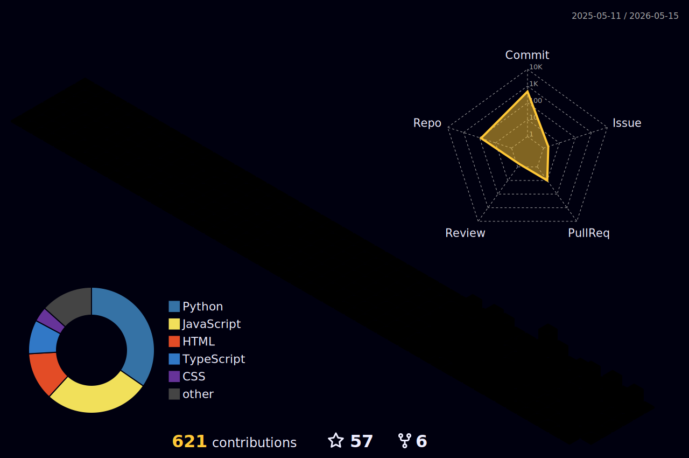

<div align="center">

<!-- Animated Header Banner -->


<br/>
<br/>

<!-- Dynamic Typing SVG -->
[](https://git.io/typing-svg)

<br/>

</div>

---

## 💫 About Me

```yaml
name: Ankit Sahoo
role: Software Developer Intern @ Envistream Smarttech
education: B.Tech CSE @ DRIEMS University
location: India 🇮🇳
interests: [AI/ML, Web Development, Open Source, Building Cool Stuff]
currently_learning: [Web Development, Software Engineering, Python, Deep Learning]
portfolio: https://ankitsahoo-portfolio.onrender.com
fun_fact: "I built a voice assistant tool like Siri!"
```


- 🔭 I'm currently working on **AI-powered projects**
- 🌱 I'm learning **Web Dev, Software Engineering & Deep Learning**
- 👯 Looking to collaborate on **creative AI projects**
- 💬 Ask me about **Python, JavaScript, AI/ML**
- 📫 Reach me at **ankitsahoo885@gmail.com**
- 🌐 Check out my portfolio: **[ankitsahoo-portfolio.onrender.com](https://ankitsahoo-portfolio.onrender.com)**
- ⚡ Fun fact: **I built a voice assistant like Siri!**

<br clear="right"/>

<div align="center">

### 🌐 [✨ Visit My Portfolio →](https://ankitsahoo-portfolio.onrender.com)

</div>

---

## 🌐 Connect With Me

<div align="center">

[](https://www.instagram.com/ankitsahoo94)
[](https://www.linkedin.com/in/ankit-sahoo94)
[](https://x.com/Ankitsahoo94)
[](mailto:ankitsahoo885@gmail.com)
[](https://ankitsahoo-portfolio.onrender.com)

</div>

---

## 🎯 Currently Working On

```text
🎭 FaceSentrix      ████████████████████░░░░░  80% — Emotion detection via CNN
💻 CodeStudio        ██████████████░░░░░░░░░░░  55% — Web-based IDE
📝 AI Notepad        ████████░░░░░░░░░░░░░░░░░  30% — Smart notes with AI
🌐 Portfolio Site    ██████░░░░░░░░░░░░░░░░░░░  25% — Personal portfolio
```

<!-- START_SECTION:weekly_stats -->
```text
📊 Weekly Contribution Activity (Last 365 Days)

Monday     42 commits      ██░░░░░░░░░░░░░░░░░░░░░░░     9.9%
Tuesday    44 commits      ██░░░░░░░░░░░░░░░░░░░░░░░    10.4%
Wednesday  63 commits      ███░░░░░░░░░░░░░░░░░░░░░░    14.9%
Thursday   53 commits      ███░░░░░░░░░░░░░░░░░░░░░░    12.5%
Friday     31 commits      █░░░░░░░░░░░░░░░░░░░░░░░░     7.3%
Saturday   142 commits     ████████░░░░░░░░░░░░░░░░░    33.6%
Sunday     48 commits      ██░░░░░░░░░░░░░░░░░░░░░░░    11.3%
```
<!-- END_SECTION:weekly_stats -->

---

## 🚀 Featured Projects

<div align="center">

| # | Project | Description | Tech Stack | Status |
|---|---------|-------------|------------|--------|
| 🎭 | **[FaceSentrix](https://github.com/algorithnicmind/FaceSentrix)** | Real-time emotion detection system using CNN | `Python` `OpenCV` `TensorFlow` `Keras` | ✅ Active |
| 💻 | **[CodeStudio](https://github.com/algorithnicmind/codestudio)** | Web-based multi-language coding IDE | `Next.js` `Monaco Editor` `TailwindCSS` | 🔧 Building |
| 🤖 | **Mitra 2.0** | AI-powered voice assistant | `Python` `Speech Recognition` `NLP` | 🚀 Shipped |
| 📝 | **AI Notepad** | Smart notepad with AI features | `JavaScript` `HTML/CSS` | 🔧 Building |

</div>

---

## 🛠️ Tech Stack

<div align="center">

### 👨‍💻 Languages


### 🧠 AI / ML


### 🌐 Web Frameworks & Libraries


### 🗄️ Databases


### ☁️ Cloud & DevOps


### 🧰 Tools


</div>

---

## 📊 GitHub Analytics

<div align="center">


<br/>


</div>

<br/>

### 🏆 GitHub Trophies

<div align="center">


</div>

<br/>

### 📈 Contribution Highlights

<div align="center">

**Activity Graph**<br/>
[](https://github.com/algorithnicmind)

<br/>

**Yearly Contributions**<br/>


<br/><br/>

**📐 3D Perspective History**<br/>


</div>

---

<div align="center">

### ✍️ Random Dev Quote


</div>

---

<div align="center">

[](https://visitcount.itsvg.in)

<br/>

### 💰 Support My Work
[](https://buymeacoffee.com/ankitsahoo3)
[](https://github.com/algorithnicmind)

<br/>


</div>
